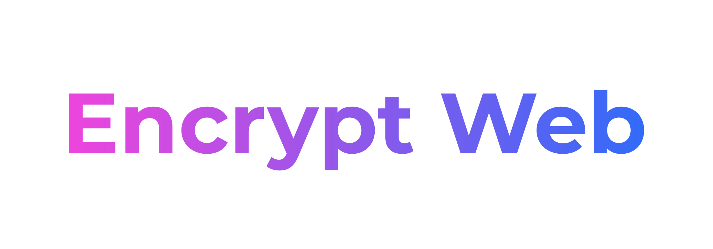

# Веб-приложение для шифрования файлов

> Предыдущая версия с консольным интерфейсом: [https://github.com/pgn55555/encrypt_cli](https://github.com/pgn55555/encrypt_cli)

## Демо веб-приложения

Демо приложения доступно по ссылке: [http://pgn55555.pythonanywhere.com/](http://pgn55555.pythonanywhere.com/)

## Поддерживаемые алгоритмы шифрования:

1. Шифр Цезаря
2. Шифр Виженера
3. Шифр Вернама

## Функции:

1. Шифрование и дешифрование файлов
2. Взлом шифра Цезаря

## Использование:

1. Склонируйте репозиторий на локальный диск.
2. Установите необходимые библиотеки:

    `pip3 install -r requirements.txt`

3. Запустите проект:

    `flask --app main run`

Веб-приложение будет доступно локально на [http://127.0.0.1:5000](http://127.0.0.1:5000)

## Стек технологий

1. Python - бэкенд
2. Flask - веб-приложение
3. Bootstrap - фронтенд